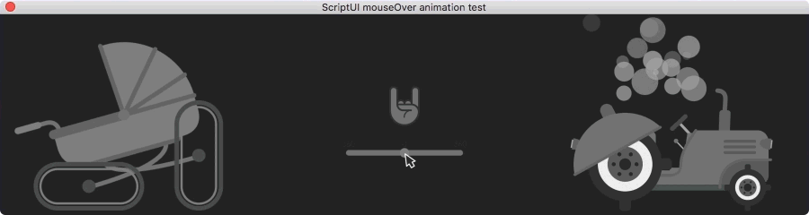

# ScriptUI animated mouseover

An example of how to use an animated sequence of *png* images for the `mouseover` event on an `Image object` in the After Effects ScriptUI panel.



Snippet uses the `app.setTimeout()` method that pings application every 1000/60th of a second. It **should not be overused**, otherwise, it will bog down the system. However, this is justifiable in our case, since we're only using it on `mouseover` event, and canceling it on `mouseout`.

## Use case

Copy the entire `function addAnimatedImage(parentGroup, options) { /.../ }` function into your code, and then invoke it like such:

```javascript
var animatedImage = addAnimatedImage(win, {
    mouseoutImages: 'path to a folder with MOUSEOUT png sequence',
    mouseoverImages: 'path to a folder with MOUSEOVER png sequence',
});
```

## License

Apache 2.0 licence
